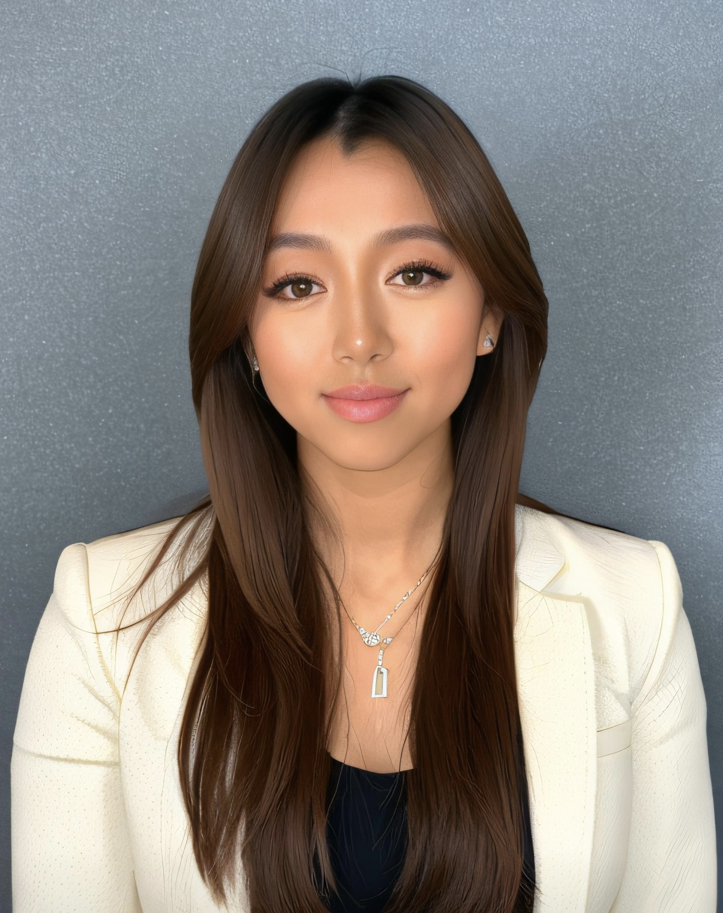

 

## About Me
Hi! My name is Tessa Wu, a current senior at Boston University majoring in Data Science with a minors in Business Administration and Mathematics. My coursework, internships, and projects have equipped me with a solid foundation in business, statistics, and computer science. With a strong understanding of data manipulation, statistical analysis, and predictive modeling, I am eager to combine my technical expertise with my passion for business and my love for global perspectives to drive forward-thinking data-drvien impacts.  

## Technical Proficiency
My journey in data science has given me a strong foundation in technical skills and data-driven decision-making. I have hone my programming abilities in languages like Python, Java, and R, and am proficient in data visualization tools such as PowerBI and Tableau. I also have hands-on experience with data preprocessing, feature engineering, and building predictive models.

## Future Aspirations
As I near the end of my undergraduate journey, I am excited to leverage my data science background and skills to make a positive impact in the world. I envision myself in a forward-thinking organization that values both innovation and a global mindset. I believe that leveraging data in a global context can create profound impacts, and I’m eager to be a part of that.
Personal Interest and Hobbies
Outside of data science and business, I enjoy traveling, music, sports, and photography! I am constantly in the mindset of growth and inpiration. I love to explore new places and learn about different cultures.

